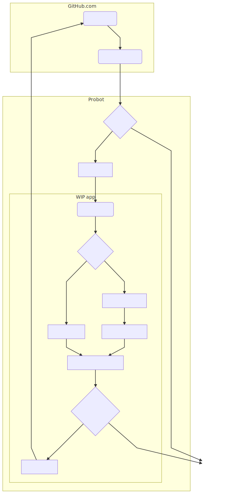

# How it works

[](https://mermaidjs.github.io/mermaid-live-editor/#/view/eyJjb2RlIjoiZ3JhcGggVEJcbiAgUkVRVUVTVChXZWJob29rIHJlcXVlc3QpIC0tIHJlY2VpdmVkIGJ5IFByb2JvdCAtLT4gSVNfVkFMSUR7aXMgdmFsaWQ_fVxuXG4gIHN1YmdyYXBoIFByb2JvdFxuICAgIElTX1ZBTElEIC0tIHllcyAtLT4gR0VUX0FVVEhFTlRJQ0FUSU9OW2F1dGhlbnRpY2F0ZV1cbiAgICBHRVRfQVVUSEVOVElDQVRJT04gLS0-IEVWRU5UX0hBTkRMRVIoRXZlbnQgaGFuZGxlcilcblxuICAgIHN1YmdyYXBoIFdJUCBhcHBcbiAgICAgIEVWRU5UX0hBTkRMRVIgLS0-IElTX1BST19QTEFOe3BybyBwbGFuP31cbiAgICAgIElTX1BST19QTEFOIC0tIG5vIC0tPiBDSEVDS19USVRMRVtDaGVjayBQUiB0aXRsZV1cbiAgICAgIElTX1BST19QTEFOIC0tIHllcyAtLT4gR0VUX0NPTkZJR1tHZXQgY29uZmlndXJhdGlvbl1cbiAgICAgIEdFVF9DT05GSUcgLS0-IEdFVF9DVVNUT01fU1RBVFVTW0dldCBjdXN0b20gc3RhdHVzXVxuICAgICAgR0VUX0NVU1RPTV9TVEFUVVMgLS0-IEdFVF9DVVJSRU5UX1NUQVRVU1xuICAgICAgQ0hFQ0tfVElUTEUgLS0-IEdFVF9DVVJSRU5UX1NUQVRVU1xuICAgICAgR0VUX0NVUlJFTlRfU1RBVFVTIC0tPkhBU19TVEFUVVNfQ0hBTkdFe3N0YXR1cyBjaGFuZ2VkP31cbiAgICAgIEhBU19TVEFUVVNfQ0hBTkdFIC0tIHllcyAtLT4gVVNbVXBkYXRlIHN0YXR1c11cbiAgICBlbmRcbiAgZW5kXG5cbiAgc3ViZ3JhcGggR2l0SHViLmNvbVxuICAgIFBSKFB1bGwgUmVxdWVzdCkgLS0gY2hhbmdlIHRyaWdnZXJzIC0tPiBSRVFVRVNUXG4gIGVuZFxuXG4gIElTX1ZBTElEIC0tIG5vIC0tPiBET05FXG4gIEhBU19TVEFUVVNfQ0hBTkdFIC0tIG5vIC0tPiBET05FXG4gIFVTIC0tPiBQUlxuICBET05FW1wiwq9cXF8o44OEKV8vwq9cIl1cblxuc3R5bGUgRE9ORSBmaWxsOiNGRkYsc3Ryb2tlLXdpZHRoOjBcbiIsIm1lcm1haWQiOnsidGhlbWUiOiJkZWZhdWx0In19)

The WIP GitHub is built with [Probot](https://probot.github.io/) – a Node.js framework for GitHub workflow automation and improvements.

When installed, the WIP app starts receiving request for every [pull request event](https://developer.github.com/v3/activity/events/types/#pullrequestevent), such as "created", "edited" or "labeled". The requests are received by Probot and verified using the Webhook Secret. If the verification succeeds, probot passes creates an authentication token for the installation and passes both the event request payload as well as the authenticated GitHub API client to the [pull request event handler](lib/handle-pull-request-change.js).

The event handler checks if the installation belongs to a free plan or a paid plan. For the free plan it only checks if the PR title contains one of the default terms such as "WIP" or "Do not merge". For the paid plan it loads the configuration and gets the status of the pull request based on that.

Then it checks the current state. Only if there is a change it sends a request to GitHub to update the status of the pull request.
